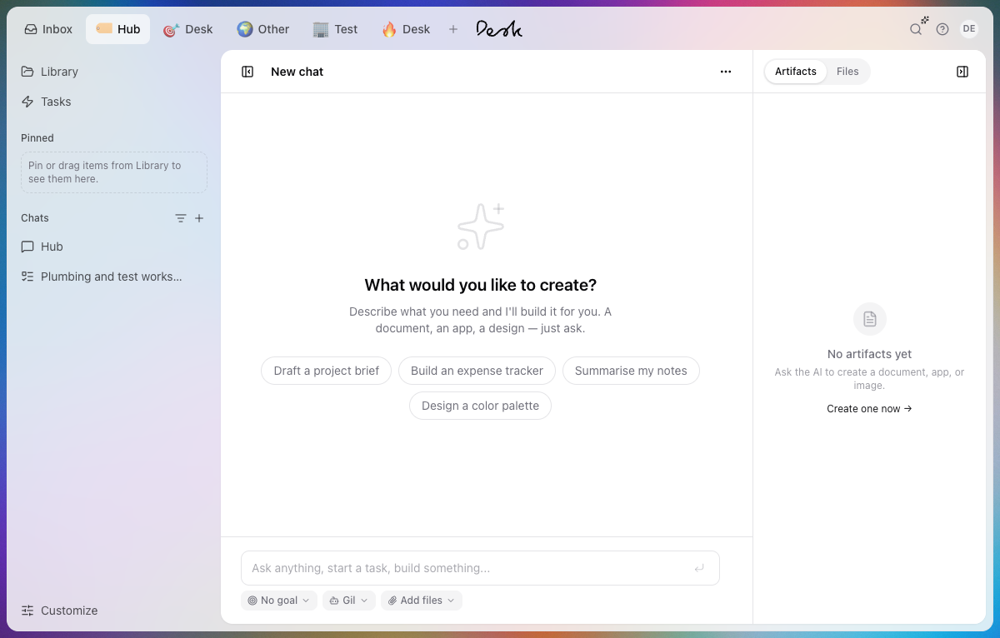
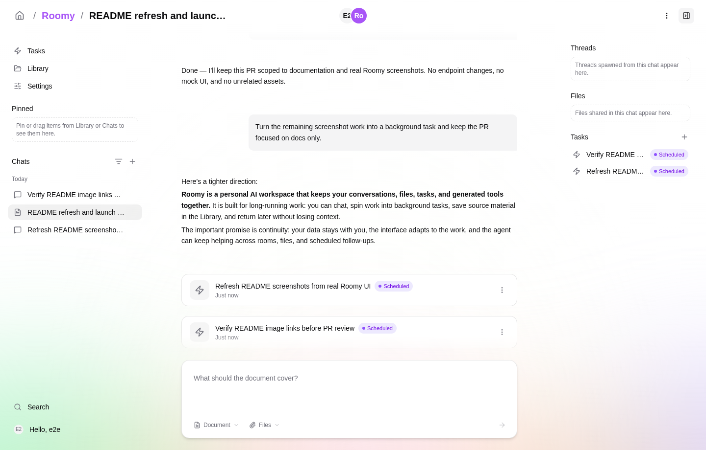
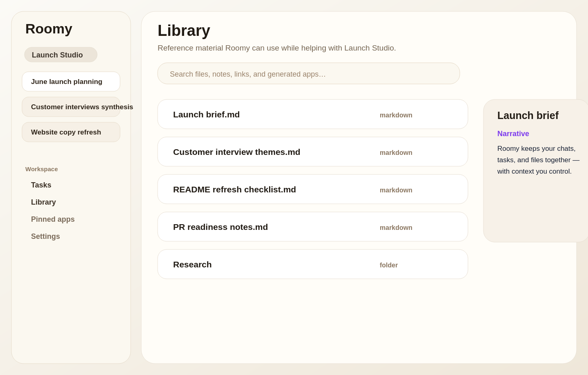

# Roomy

An AI that knows you, stays with you, and is yours to make.

Roomy is a personal AI platform for people who use AI every day to do real work — and who want their tools to fit them, not the other way around. It runs alongside you, gets better at helping you the longer you spend with it, and stays yours no matter what changes underneath.



## How it works

**Your conversations, files, and context live with you.** Everything Roomy learns about your work — the projects you're running, the people you talk about, the way you write — is stored on your machine, in a place you can see and control. Back it up, move it to a new computer, take it with you to a different deployment. The relationship doesn't restart when the environment changes.

**Roomy works across AI providers.** When one provider is down, slow, or no longer the best fit for what you're doing, your work continues. The same conversations, the same context, the same Roomy — just on a different model underneath. You bring the API keys; Roomy handles the routing.

**The AI parts stay out of your way.** Context windows, model selection, agent orchestration, token budgets — these are implementation details. Roomy handles them. You focus on the work.

## What you can do

- **Chat with an AI that knows your work.** The longer you spend with it, the more it picks up about your projects, the people in them, and the way you like things done. What you talked about months ago is still there, still searchable, still part of what shapes today's answer.

  

- **Organize your life into workspaces.** Separate spaces for separate parts of life — client work, personal projects, research — each with its own context.
- **Keep your reference material in one place.** Upload files, save links, take notes. Roomy uses them as context for everything else.

  

- **Stay on top of what's running.** A Today view collects everything waiting on you — agent questions, failed runs, and scheduled tasks — so you don't have to hunt through chats.

  

- **Pick up where you left off.** Documents, plans, and apps the AI produces stay attached to the conversation that made them — easy to return to, easy to keep building on.
- **Build small apps inside Roomy.** Pin them to your workspace, hand them to the AI as tools, and shape the surface into something only you would have built.
- **Connect the tools you already use.** GitHub, Notion, Slack, Linear, Figma — Roomy reads them for context and acts on them when you ask.

## Where it runs

Roomy is open source software you run yourself — on your own laptop, or on a server you control if you want it reachable from anywhere. No accounts to sign up for, no vendor in the middle. Where Roomy lives, your data lives.

## Download

Pre-built macOS desktop app releases are available on the [releases page](https://github.com/bgrgicak/Desk/releases/tag/desktop-latest) (Apple Silicon · arm64). New builds are published weekly.

---

## For developers

### Quick start

```bash
git clone git@github.com:bgrgicak/Desk.git
cd Roomy
npm install
npm run dev
```

`npm run dev` boots `roomy-server` (tsx watch) and Vite together, and rebuilds the `roomy/sandbox:v1` Docker image when its inputs change; one `Ctrl+C` stops both. Open <http://localhost:5173/>. Roomy auto-signs in to the local owner account in both dev and production builds; set `ROOMY_AUTO_LOGIN=off` if you need to force the manual login screen.

### Prerequisites

| Tool | macOS | Linux |
| --- | --- | --- |
| Node.js 23 + npm (pinned by `.nvmrc` + `engines`) | use [volta](https://volta.sh/), [fnm](https://github.com/Schniz/fnm), [nvm](https://github.com/nvm-sh/nvm), mise, or asdf | use [volta](https://volta.sh/), [fnm](https://github.com/Schniz/fnm), [nvm](https://github.com/nvm-sh/nvm), mise, or asdf |
| Docker | [Docker Desktop](https://www.docker.com/products/docker-desktop/) | rootful or rootless — both auto-detected |

API keys are configured per-user via Settings after the first sign-in. `npm run dev` generates `ROOMY_VAULT_PASSWORD` into `.env` on first run so the per-user secrets vault can auto-unlock on restart.

### Common commands

Run from the repo root.

| Command | What it does |
| --- | --- |
| `npm run dev` | Boot `roomy-server` + Vite. |
| `npm run dev:app` | Vite only — useful when `roomy-server` runs elsewhere. |
| `npm run dev:desktop` | Build server + app, then launch the Electron desktop app (`cd packages/desktop && npm run dev`). Requires the server packages to be built first (`npm run build:server`). |
| `npm run build` | Build all workspace packages (Nx). |
| `npm run typecheck` | Run tsc on all workspaces. |
| `npm run test:host` | Vitest unit + integration tests. |
| `npm run test:e2e` | Playwright against a spawned `roomy-server` + Vite preview. |
| `npm run ci:local` | Full local CI mirror — run before non-trivial changes (requires Node 23 + Docker). |

See [packages/server/README.md](packages/server/README.md) for the full package layout, manual API/Postman flow, and deeper dev notes; see [packages/server/docs/dev-environment.md](packages/server/docs/dev-environment.md) for the host-only setup specifics (Docker socket detection, sandbox UID, etc.).

### Troubleshooting

- **`roomy-server` exits immediately** — inspect logs and check `~/Roomy/` for stale state. Migrations run idempotently on every boot, but a half-applied earlier run can wedge them.
- **`docker` commands fail with permission denied (Linux)** — log out and back in once after `sudo usermod -aG docker $USER`, or wrap with `sg docker -c "..."`.
- **Sandbox bind-mount writes fail under rootless docker** — the runtime detects rootless mode and runs the container as UID 0. If it doesn't, pin via `ROOMY_SANDBOX_USER=0:0`.
- **`vite: command not found`** — run `npm install` at the repo root.

### Contributing

Open issues and pull requests are welcome. Before starting on a feature, check [AGENTS.md](AGENTS.md) for the testing and review approach the project uses.

### License

MIT — see [LICENSE](LICENSE).
