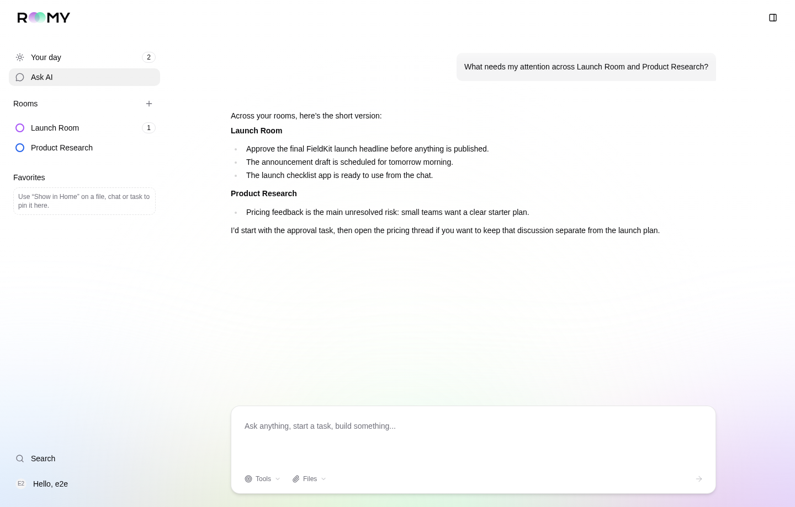
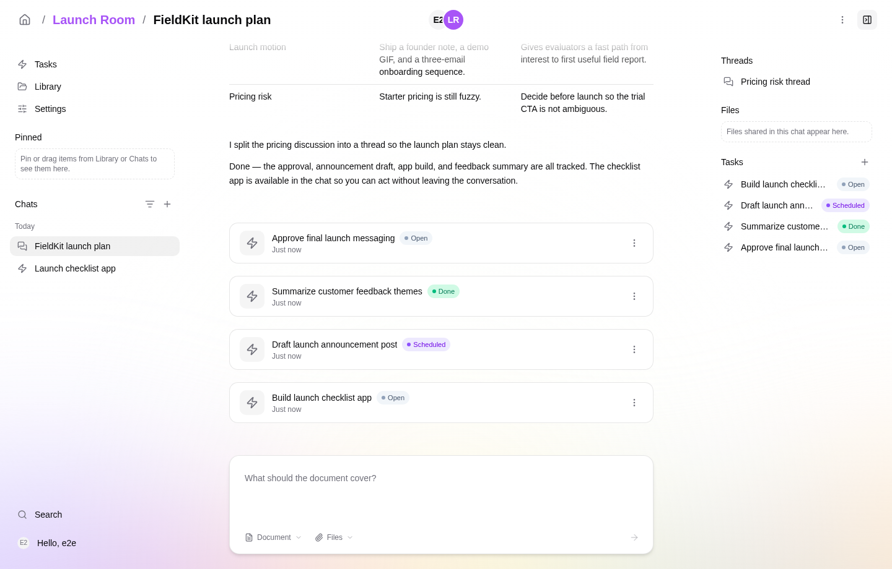
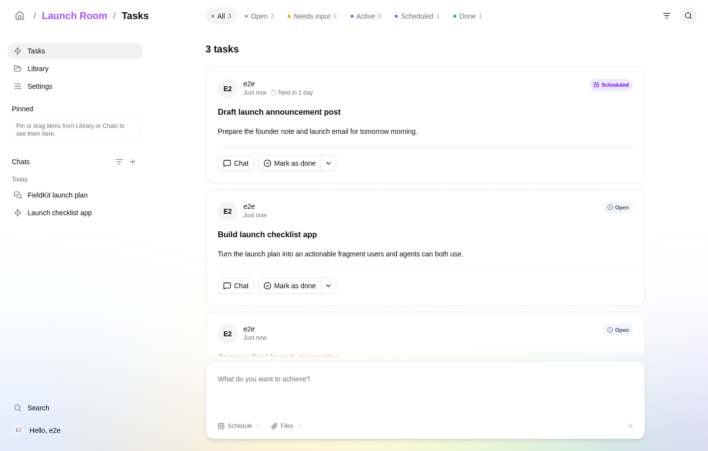
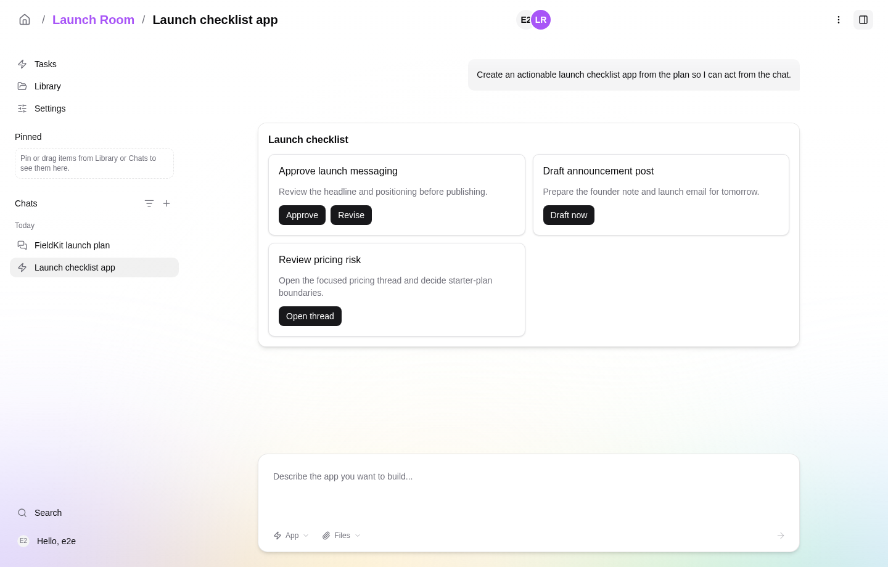

# Roomy

An AI that knows you, stays with you, and is yours to make.

Roomy is a personal AI platform for people who use AI every day to do real work — and who want their tools to fit them, not the other way around. It runs alongside you, gets better at helping you the longer you spend with it, and stays yours no matter what changes underneath.



## How it works

**Your conversations, files, and context live with you.** Everything Roomy learns about your work — the projects you're running, the people you talk about, the way you write — is stored on your machine, in a place you can see and control. Back it up, move it to a new computer, take it with you to a different deployment. The relationship doesn't restart when the environment changes.

**Roomy works across AI providers.** When one provider is down, slow, or no longer the best fit for what you're doing, your work continues. The same conversations, the same context, the same Roomy — just on a different model underneath. You bring the API keys; Roomy handles the routing.

**The AI parts stay out of your way.** Context windows, model selection, agent orchestration, token budgets — these are implementation details. Roomy handles them. You focus on the work.

## What you can do

- **Ask AI across everything.** Ask AI is one global thread that can reason across your rooms, files, chats, and tasks, so you can ask what needs attention without remembering where the work happened.
- **Chat with an AI that knows your work.** The longer you spend with it, the more it picks up about your projects, the people in them, and the way you like things done. What you talked about months ago is still there, still searchable, still part of what shapes today's answer.
- **Organize your life into workspaces.** Separate spaces for separate parts of life — client work, personal projects, research — each with its own context.
- **Fork conversations into threads.** Spin a focused question out of a busy chat so the main conversation stays readable and the thread gets only the context it needs.

  

- **Keep your reference material in one place.** Upload files, save links, take notes. Roomy uses them as context for everything else.
- **Stay on top of what's running.** A Today view collects everything waiting on you — agent questions, failed runs, and scheduled tasks — so you don't have to hunt through chats.

  

- **Pick up where you left off.** Documents, plans, and apps the AI produces stay attached to the conversation that made them — easy to return to, easy to keep building on.
- **Build small apps inside Roomy.** Pin them to your workspace, hand them to the AI as tools, and shape the surface into something only you would have built. Apps are made from fragments, so agents can give you focused interfaces — and you can act from the chat instead of switching tools.

  
- **Connect the tools you already use.** GitHub, Notion, Slack, Linear, Figma — Roomy reads them for context and acts on them when you ask.

## Screenshots

The README screenshots live in [`docs/screenshots/`](docs/screenshots/). They are checked in PNGs used by this page; if the UI changes, refresh those files in place so the links above stay valid.

## Where it runs

Roomy is open source software you run yourself — on your own laptop, or on a server you control if you want it reachable from anywhere. No accounts to sign up for, no vendor in the middle. Where Roomy lives, your data lives.

## Install

Two ways to run Roomy. Pick one — you don't need both.

### Option 1 — Run from npm (macOS, Linux, Windows WSL)

One command, no clone:

```sh
npx @roomy-ai/cli
```

This downloads the [`@roomy-ai/cli`](https://www.npmjs.com/package/@roomy-ai/cli) package, boots `roomy-server` in the foreground, and opens the UI at <http://127.0.0.1:35138/>. Stop it with `Ctrl+C`.

Prefer a persistent install:

```sh
npm install -g @roomy-ai/cli
roomy            # same as `roomy start`
```

**Requirements:** Node.js ≥ 22. On Linux, have Docker or nerdctl running locally. On macOS, the CLI can bootstrap Colima/nerdctl on first start if Docker Desktop is not available. Roomy uses a sandboxed container to run AI agents.

**Run in the background** as a system service (launchd on macOS, systemd-user on Linux, Task Scheduler on Windows):

```sh
roomy service install        # register + start
roomy service status         # check it's running
roomy service stop           # stop without removing
roomy service uninstall      # remove the service entry
```

Update an installed service from npm, or build a local checkout into a staged
`ROOMY_HOME/current` release before restarting:

```sh
roomy service update --tag=latest
roomy service update --source /opt/roomy-dev
```

**Uninstall everything:**

```sh
roomy uninstall                       # remove service + sandbox container images
roomy uninstall --remove-roomy-files  # also delete ~/Roomy (your data)
npm uninstall -g @roomy-ai/cli        # remove the CLI itself
```

Your conversations, files, and vault live in `~/Roomy/` — back that up to move between machines.

### Option 2 — macOS desktop app

Pre-built DMG releases are published from GitHub Releases when release tags are cut. The desktop app uses the same data directory (`~/Roomy/`) and the same server underneath — just wrapped in an Electron shell.

### First-run setup

The first time you open Roomy:

1. Create your owner account and a vault password (used to encrypt your API keys at rest).
2. Open **Settings → AI providers** and paste an Anthropic and/or OpenAI API key. Roomy routes between providers; you bring the keys.
3. Start a chat.

On every server restart the vault locks — re-enter the vault password through the dialog. Set `ROOMY_AUTO_LOGIN=off` if you want to force the manual login screen instead of auto-signing in as the owner.

---

## For developers

Only needed if you want to contribute or hack on Roomy itself. End users should use one of the [install options](#install) above.

### Quick start

```bash
git clone git@github.com:bgrgicak/Desk.git
cd Desk
npm install --include=optional
npm run dev
```

`npm run dev` boots `roomy-server` (tsx watch) and Vite together, builds any missing built-in app bundles, and rebuilds the `roomy/sandbox:v1` Docker image when its inputs change; one `Ctrl+C` stops both. Dev defaults to API <http://127.0.0.1:35139/> and app <http://127.0.0.1:5174/> so it can run beside a published install on port 35138.

### Prerequisites

| Tool | macOS | Linux |
| --- | --- | --- |
| Node.js 23.x + npm (pinned by `.nvmrc` + `engines`) | use [volta](https://volta.sh/), [fnm](https://github.com/Schniz/fnm), [nvm](https://github.com/nvm-sh/nvm), mise, or asdf | use [volta](https://volta.sh/), [fnm](https://github.com/Schniz/fnm), [nvm](https://github.com/nvm-sh/nvm), mise, or asdf |
| Container runtime | Docker Desktop or Colima/nerdctl | Docker rootful/rootless or nerdctl/containerd — auto-detected |

API keys are configured per-user via Settings after the first sign-in. The per-user secrets vault is created and unlocked through the signup wizard (first run) and the in-app VaultDialog (returning users); on every server restart, the vault locks and the user re-enters their vault password through the dialog.

### Common commands

Run from the repo root.

| Command | What it does |
| --- | --- |
| `npm run dev` | Boot `roomy-server` on `:35139` + Vite on `:5174`; also prepares missing built-in app bundles and the sandbox image. |
| `npm run dev:app` | Vite only — useful when `roomy-server` runs elsewhere. |
| `npm run dev:desktop` | Launch the Electron desktop app from `packages/desktop`. First run: `cd packages/desktop && npm install`, and build server packages first with `npm run build:server`. |
| `npm run build` | Build server packages, the app scaffold package, and the web app. |
| `npm run typecheck` | Run tsc on all workspaces. |
| `npm run test:host` | Vitest unit + integration tests. |
| `npm run test:e2e` | Playwright against a spawned `roomy-server` + Vite preview. |
| `npm run ci:local` | Full local CI mirror — run before non-trivial changes (requires Node 23 + Docker). |

See [packages/server/README.md](packages/server/README.md) for the full package layout, manual API/Postman flow, and deeper dev notes; see [packages/server/docs/dev-environment.md](packages/server/docs/dev-environment.md) for the host-only setup specifics (Docker socket detection, sandbox UID, etc.).

### Troubleshooting

- **`roomy-server` exits immediately** — inspect logs and check `~/Roomy/` for stale state. Migrations run idempotently on every boot, but a half-applied earlier run can wedge them.
- **`docker` commands fail with permission denied (Linux)** — log out and back in once after `sudo usermod -aG docker $USER`, or wrap with `sg docker -c "..."`.
- **Sandbox bind-mount writes fail under rootless docker** — the runtime detects rootless mode and runs the container as UID 0. If it doesn't, pin via `ROOMY_SANDBOX_USER=0:0`.
- **`vite: command not found`** — run `npm install` at the repo root.

### Publishing a release

Maintainers only. Releases are cut with a single interactive script from a Linux or macOS dev box.

**One-time prerequisites:**

- `npm login` — your npm account must have publish access to the [`@roomy-ai`](https://www.npmjs.com/org/roomy-ai) scope.
- `docker login` — your Docker Hub account must have push access to the sandbox image repo.
- `gh auth login` — used to create the GitHub Release and trigger the desktop build workflow.
- Node.js 23 (matches the `.nvmrc` pin).

**Cut a release:**

```sh
git checkout trunk && git pull
npm run release
```

The script walks you through it interactively:

1. Pre-flight checks (clean tree, on `trunk`, all four logins above present).
2. Pick a version — next patch, next minor, next major, or a custom string. Packages publish under the `latest` dist-tag.
3. Bumps every public workspace (`packages/app`, `packages/cli`, `packages/ui`, `packages/server/*`) plus `packages/desktop` to the new version.
4. Runs `npm install`, `npm run build`, and a `npm pack` smoke test.
5. **Final confirm** — last chance to bail before anything is published.
6. Commits `chore(release): vX.Y.Z`.
7. `npm publish --workspaces --access public` (publishes under the `latest` dist-tag).
8. Builds and pushes the sandbox Docker image to Docker Hub as `bgrgicak/roomy-ai:vX.Y.Z` and `bgrgicak/roomy-ai:latest` by default (override with `ROOMY_DOCKER_REPO`).
9. Creates the `vX.Y.Z` git tag and pushes `trunk` + tag to `origin`. The tag push triggers [`.github/workflows/desktop-release.yml`](.github/workflows/desktop-release.yml), which builds the macOS DMG on a `macos-latest` runner and uploads it to the GitHub Release.
10. Optionally `gh run watch`es the desktop workflow.

**If a step fails mid-flight:** the version-bump commit stays, but the git tag is only created after npm + Docker both succeed, so the desktop workflow won't fire for a half-published release. Fix the issue, bump to a fresh version, and re-run.

**Re-uploading desktop installers from a different host:** the macOS DMG ships from the CI runner automatically. If you want to attach a Linux or Windows installer to the same release, run `electron-builder --publish always` from that host against the existing tag.

### Contributing

Open issues and pull requests are welcome. Before starting on a feature, check [AGENTS.md](AGENTS.md) for the testing and review approach the project uses.

### License

MIT — see [LICENSE](LICENSE).
